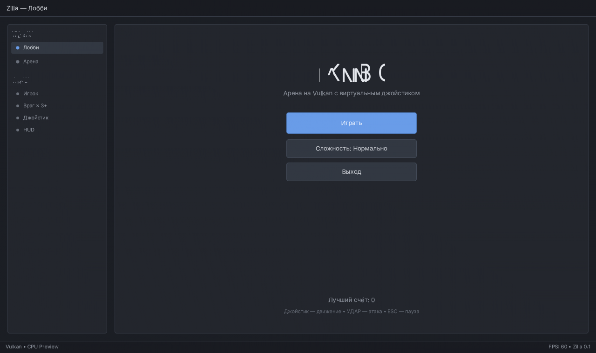
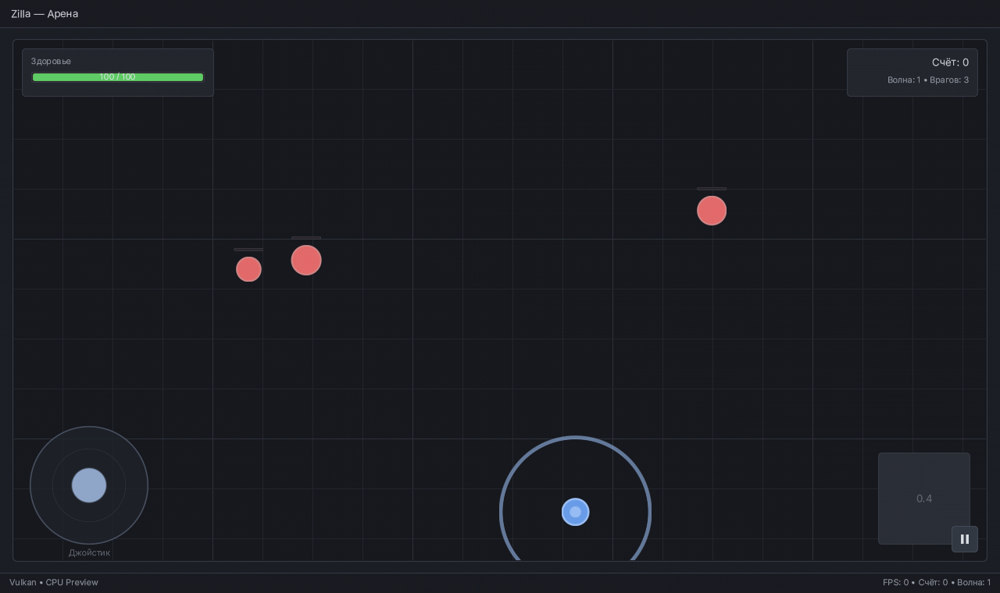
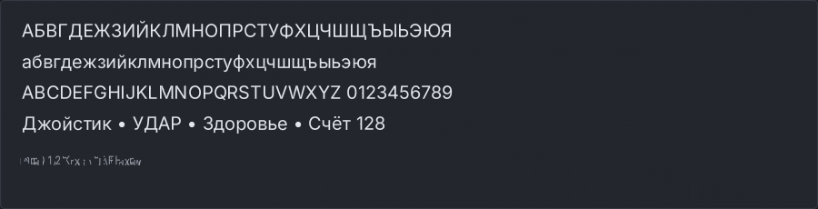

<p align="center">
  <b>ZILLA</b><br>
  <sub>Небольшая игра на C++ напрямую через Vulkan, с интерфейсом в стиле Godot</sub>
</p>

## Что это

Zilla — минималистичная игра, которой больше нет нужды в движке: весь рендер
написан руками на Vulkan (один render pass, один пайплайн, один динамический
вершинный буфер), интерфейс — немедленный (immediate mode), текст
растеризуется в SDF-атлас шрифта Inter, который Godot использует в своём
редакторе. Панели, кнопки и подписи намеренно повторяют тёмную тему Godot 4.

Что внутри:

- **Лобби** в виде окна редактора: док со «сценами» и «узлами», заголовок,
  кнопки «Играть / Сложность / Выход», статус-бар с именем GPU и FPS.
- **Арена**: сетка как в 2D-редакторе Godot, HUD (здоровье, счёт, волна).
- **Виртуальный джойстик** в левом нижнем углу (мышь, палец или перо — всё,
  что отдаёт события указателя). Плюс WASD для десктопа.
- **Враг**: появляется у краёв, преследует игрока, наносит урон при контакте;
  круглая кнопка **УДАР** (или пробел) раздаёт урон по площади с откатом.
  Волны усиливаются каждые 6 убийств.
- **Текст и кнопки** — шрифт Inter (Regular и Bold) с кириллицей, SDF-атлас,
  скруглённые панели Godot-синего акцента.

Репозиторий раньше был форком Godot Engine. Весь исходный код движка
(`core/`, `scene/`, `servers/`, `editor/`, `modules/`, `drivers/`,
`platform/`, `thirdparty/*` и всё остальное, 12 758 файлов) удалён: от него
остались только шрифт Inter, заголовки Vulkan, volk и stb_truetype — ровно то,
что нужно этой игре.

## Скриншоты

Картинки ниже отрендерены офлайн-превью (`make preview`) — тем же самым
списком примитивов, что отправляется в Vulkan, но растеризованным на CPU.
Это позволяет смотреть интерфейс и проверять кириллицу без GPU.

| Лобби | Арена |
| --- | --- |
|  |  |



## Зависимости

- Компилятор с C++17 (gcc 9+, clang 10+, MSVC 2019+)
- [GLFW](https://www.glfw.org/) 3.3+ (окно, указатель, клавиатура)
- Vulkan: заголовки уже лежат в `thirdparty/vulkan`, но нужен установленный
  **Vulkan runtime** (драйвер + `libvulkan.so.1` / `vulkan-1.dll`)
- `make`
- Необязательно: `glslangValidator` из Vulkan SDK — только чтобы
  пересобрать шейдеры (`make shaders`). Готовые SPIR-В модули уже в репозитории.

Установка зависимостей:

```bash
# Debian / Ubuntu
sudo apt install build-essential libglfw3-dev mesa-vulkan-drivers
# Fedora
sudo dnf install gcc-c++ glfw-devel vulkan-loader mesa-vulkan-drivers
# macOS
brew install glfw molten-vk
# Windows (MSYS2)
pacman -S mingw-w64-x86_64-gcc mingw-w64-x86_64-glfw
```

## Сборка и запуск

```bash
make            # -> build/zilla
make run        # собрать и запустить (ZILLA_ASSETS=assets)
./build/zilla --validation          # с слоями валидации Vulkan
./build/zilla --width 1600 --height 900
make preview    # PNG-скриншоты в build/ (GPU не нужен)
make shaders    # пересобрать SPIR-V из shaders/*.glsl
make clean
```

Игра ищет шрифты в `assets/` рядом с исполняемым файлом или в текущей папке.
Если запускаете из другого каталога — укажите путь:

```bash
ZILLA_ASSETS=/path/to/Zilla/assets ./build/zilla
```

## Управление

| Действие | Управление |
| --- | --- |
| Движение | виртуальный джойстик слева (мышь/палец) или WASD |
| Атака | круглая кнопка **УДАР** справа или пробел |
| Пауза | ESC или кнопка `❚❚` в углу арены |
| Выход | «Выход» в лобби |

## Как устроено

```
assets/fonts/        Inter Regular/Bold (из Godot, OFL) + лицензия
shaders/             quad.vert.glsl / quad.frag.glsl + готовый SPIR-V в shaders/spv/
src/core/            логи, типы (Vec2, Rect, Color, Rng)
src/platform/        окно и ввод (GLFW), независимый снимок InputState
src/gfx/             draw_list (примитивы), font (SDF-атлас), vulkan (рендерер)
src/ui/              тема Godot и немедленный UI: панели, кнопки, джойстик
src/game/            лобби, арена, игрок, враги, частицы
tools/               превью-рендерер на CPU, генератор заголовка шейдеров, subset шрифта
thirdparty/          volk, заголовки Vulkan, stb_truetype / stb_image_write
```

Ключевая идея: игровой и интерфейсный код ничего не знает про Vulkan. Он
складывает примитивы в `DrawList` (прямоугольники со скруглением, круги и
глифы — всё это один и тот же квад), а дальше:

- `src/gfx/vulkan.cpp` заливает `DrawList` в вершинный буфер и рисует его
  одним пайплайном (скруглённые прямоугольники и SDF-текст считает фрагментный
  шейдер);
- `tools/preview.cpp` растеризует тот же `DrawList` на CPU и пишет PNG — тем же
  самым шейдерным кодом, переписанным на C++.

## Лицензии

Код игры — MIT, см. [LICENSE.txt](LICENSE.txt).

- Шрифт **Inter** взят из Godot (`thirdparty/fonts`), лицензия OFL 1.1,
  файл `assets/fonts/LICENSE.Inter.txt`.
- **volk** (MIT), **Vulkan-Headers** (Apache-2.0 / MIT), **stb_truetype** и
  **stb_image_write** (MIT / public domain) — в `thirdparty/` вместе с
  лицензиями.
